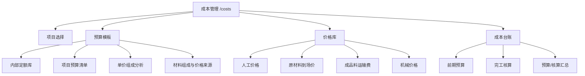

# 成本管理模块说明

更新时间：2026-06-09

## 目标范围

成本管理模块只服务单个项目的成本预算与完工核算，不考虑公司运营成本。当前业务重点限定在路面专业，优先覆盖沥青路面，不展开到完整造价软件的全部专业。

| 范围 | 当前口径 |
| --- | --- |
| 管理对象 | 单个项目 |
| 主线流程 | 前期成本预算 -> 完工成本核算 -> 预算/核算差异 |
| 专业范围 | 路面专业，优先沥青路面 |
| 不纳入范围 | 公司运营成本、完整企业级造价系统、混凝土路面专业细化 |
| 页面入口 | `/costs`，一级导航为“成本管理” |

## 页面结构

| 工作区 | 用途 | 当前状态 |
| --- | --- | --- |
| 预算模板 | 建立清单项、内部定额、单价组成分析 | 已有页面模板和 AC-20C/AC-13C 示例，数据暂为前端静态 |
| 价格库 | 维护人工、材料、运输、机械价格 | 已有页面模板，数据暂为前端静态 |
| 成本台账 | 录入项目预算成本和完工核算成本 | 已接入 `project_cost_entries` 落库 |

## 已确定业务口径

| 事项 | 决定 |
| --- | --- |
| 内部定额基准单位 | 沥青混凝土优先按 `m3` 维护，项目清单可按厚度换算为 `m2` |
| m2 换算 | `m2 综合单价 = m3 综合单价 × 厚度(m)` |
| 厚度填写 | 用 `cm` 输入，换算时除以 100；例如 6cm = 0.06m |
| 原材料价格 | 原材料按到场价维护，不再单独拆原材料运输费 |
| 成品料运输 | 成品沥青混合料运输作为直接成本，按项目运距带入 |
| 运距位置 | 运距在清单项/测算参数中填写，不放在价格库 |
| 费率位置 | 管理费率、利润率、税率在清单项/测算参数中填写 |
| 单价组成表 | 只列人工、材料、成品料运输、机械等直接成本 |
| 不列入单价组成表 | 小型机具及边角处理、现场管理及风险暂不作为直接组成行 |
| 内部定额库分类 | 不按“面层/油层/旧路”等做复杂分类，路面清单项数量少时直接展示定额清单 |

## 预算模板计算口径

### 测算参数

| 参数 | 说明 |
| --- | --- |
| 显示单位 | `m3` 或 `m2`，用于切换单价组成表展示口径 |
| 厚度(cm) | 用于 `m3` 和 `m2` 换算 |
| 压实密度(t/m3) | 用于计算成品料吨耗 |
| 损耗率(%) | 用于调整吨耗 |
| 成品料运距(km) | 用于计算成品料运输直接成本 |
| 管理费率(%) | 按直接成本计取 |
| 利润率(%) | 按直接成本加管理费计取 |
| 税率(%) | 按直接成本、管理费、利润合计计取 |

### 公式

| 指标 | 公式 |
| --- | --- |
| 损耗系数 | `1 + 损耗率 / 100` |
| m3 吨耗 | `压实密度 × 损耗系数` |
| m2 吨耗 | `m3 吨耗 × 厚度(m)` |
| 材料费 | `当前单位吨耗 × 材料配比 × 原材料到场价` |
| 成品运输费 | `当前单位吨耗 × 项目运距 × t·km 运价` |
| 直接成本 | `人工 + 材料 + 成品运输 + 机械` |
| 管理费 | `直接成本 × 管理费率` |
| 利润 | `(直接成本 + 管理费) × 利润率` |
| 税金 | `(直接成本 + 管理费 + 利润) × 税率` |
| 综合单价 | `直接成本 + 管理费 + 利润 + 税金` |

## 价格库口径

价格库目前作为“成本管理”的二级工作区，不作为一级导航。

| 分类 | 维护内容 | 关键字段 |
| --- | --- | --- |
| 人工价格 | 工种预算价或历史均价 | 工种、单位、单价、地区、来源、获取时间、说明 |
| 原材料到场价 | 沥青、集料、矿粉等到场价 | 名称、规格、单位、到场价、税价口径、到场位置、来源、获取时间 |
| 成品料运输费 | 成品沥青混合料从拌合站到现场的基准运价 | 运输对象、运输方式、计价单位、基准运价、计价口径、包含内容、来源、获取时间 |
| 机械价格 | 台班或租赁价格 | 名称、规格、单位、单价、燃油口径、操作手口径、来源、获取时间 |

注意：成品料运输费只维护 `元/t·km`、`元/车·km` 等基准运价，不维护项目运距。项目运距属于具体清单项测算参数。

## 成本台账口径

成本台账用于单项目的预算成本和完工核算成本对比。

| 字段/指标 | 说明 |
| --- | --- |
| phase | `budget` 表示前期预算，`actual` 表示完工核算 |
| category | 当前支持 `labor`、`material`、`machine`、`other` |
| amount | 可手填；若未填写，则按 `quantity × unitCost` 计算 |
| 预算成本 | 前期预算行金额合计 |
| 核算成本 | 完工核算行金额合计 |
| 成本差异 | `核算成本 - 预算成本` |
| 预算利润 | `合同金额 - 预算成本` |
| 核算利润 | `累计结算金额 - 核算成本` |
| 毛利率 | `利润 / 金额 × 100%` |

当前 `category` 还没有单独的 `transport` 分类。预算模板里“运输”已经作为直接成本组成出现，后续如果成本台账也要单独统计运输，应扩展 `CostCategory` 和相关汇总展示。

## 当前实现文件

| 文件 | 作用 |
| --- | --- |
| `src/router/index.ts` | 注册 `/costs` 路由 |
| `src/router/app-shell.ts` | 注册“成本管理”导航入口 |
| `src/views/costs/CostManagement.vue` | 成本管理独立页面，承载三个工作区 |
| `src/views/costs/components/CostBudgetTemplatePanel.vue` | 预算模板、内部定额、单价组成分析 |
| `src/views/costs/PriceLibrary.vue` | 价格库页面模板 |
| `src/views/costs/useCostManagement.ts` | 成本管理页面状态、项目切换、保存动作 |
| `src/views/costs/cost-management.controller.ts` | 页面控制器，负责保存前校验和调用服务 |
| `src/views/costs/cost-management.service.ts` | 页面数据快照加载 |
| `src/views/projects/components/ProjectCostManagementPanel.vue` | 成本台账编辑面板 |
| `src/services/costing.service.ts` | 成本汇总、利润、毛利率、差异计算 |
| `src/services/project-cost.service.ts` | `project_cost_entries` 持久化服务 |
| `src/services/db-schema.ts` | `project_cost_entries` 表结构 |
| `src/views/costs/cost-management.css` | 成本管理页面样式 |
| `src/views/costs/price-library.css` | 价格库页面样式 |

## 数据落库现状

| 模块 | 是否落库 | 说明 |
| --- | --- | --- |
| 成本台账 | 是 | 使用 `project_cost_entries`，按项目和阶段保存 |
| 预算模板 | 否 | 目前是前端静态示例，后续需要拆出正式内部定额库、清单项、单价组成表 |
| 价格库 | 否 | 目前是前端静态示例，后续需要拆出人工、材料、运输、机械价格表 |

### `project_cost_entries`

| 字段 | 说明 |
| --- | --- |
| `project_id` | 项目 ID |
| `phase` | `budget` 或 `actual` |
| `category` | 成本分类 |
| `item_name` | 成本项目 |
| `spec` | 规格/说明 |
| `unit` | 单位 |
| `quantity` | 数量 |
| `unit_cost` | 单价 |
| `amount` | 金额 |
| `occurred_on` | 日期 |
| `note` | 备注 |

## 后续跟进建议

| 优先级 | 事项 | 说明 |
| --- | --- | --- |
| P0 | 将预算模板静态数据拆成正式数据模型 | 建立内部定额库、清单项、组成行、材料配比、来源说明 |
| P0 | 将价格库落库 | 建立人工、原材料到场价、成品运输费、机械价格表，并保留价格来源和获取时间 |
| P1 | 建立清单项与内部定额的匹配关系 | 一个清单项可绑定一个内部定额模板，并覆盖项目厚度、运距、费率 |
| P1 | 增加材料组成默认模板来源说明 | 每个配比和用量应能记录规范/历史项目/内部经验来源 |
| P1 | 扩展运输分类 | 若完工核算要单独统计运输，应新增 `transport` 成本分类 |
| P2 | 增加版本管理 | 内部定额和价格需要保留历史版本，避免价格更新影响已归档预算 |
| P2 | 增加导入导出 | 支持 Excel 导入价格库、导出单价分析表和项目预算表 |
| P2 | 增加审批/锁定 | 预算定稿后应可锁定，后续变更通过版本或调整单处理 |

## 需要避免的误区

| 误区 | 正确处理 |
| --- | --- |
| 把价格库做成一级导航 | 价格库只作为成本管理二级工作区 |
| 在价格库维护项目运距 | 运距属于具体项目/清单项参数 |
| 原材料到场后再拆运输 | 原材料按到场价处理，不重复计算运输 |
| 把完整造价软件全部照搬进来 | 只抽取路面专业、内部管理需要的部分 |
| 把管理费、利润、税金写进直接成本组成行 | 直接成本表只列人材机运，费率在清单项测算层计算 |
